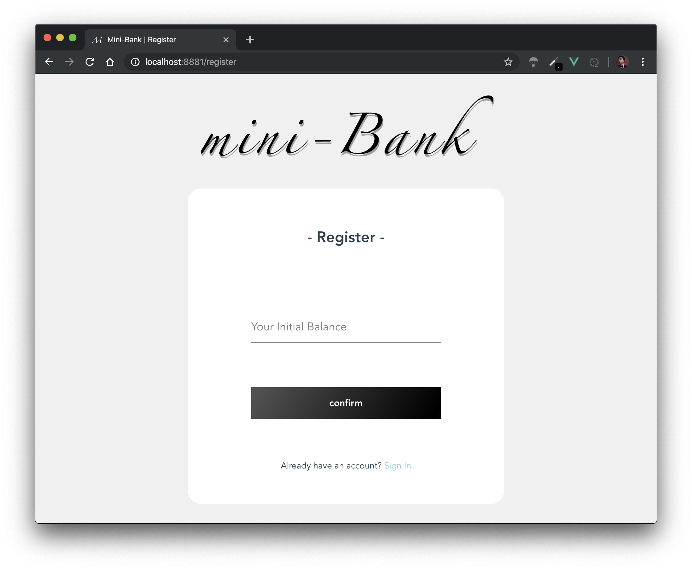

# 中山大学数据科学与计算机学院本科生实验报告（2019年秋季学期）

> 我的 Github 仓库地址：[Mini-Bank](https://github.com/PieNam/Mini-Bank)，项目的所有源代码、过程中的记录、文档、报告也都整理在该仓库下：
>
> - **项目设计说明、功能测试文档、前后端交互 API 设计文档**见仓库一级目录下的 `doc/`；
> - **课程设计项目报告** .md 源文件和 pdf 见仓库一级目录下的 `doc-repo/`；
> - **前、后、链端源代码**见仓库一级目录下对应的 `mb-XX-end/`；
>
> 这是项目的 Web 端应用运行 [Demo 视频](https://v.youku.com/v_show/id_XNDQ2Nzk0NDgxMg==.html?spm=a2h9p.12366999.app.SECTION~MAIN~SECTION~MAIN~5~5!2~5!3~5~5~5~5~5~21~22~TR~TD!2~5~5!2~H4~A)，其与界面表现展示的说明见本报告第三部分。

|   课程名称：   | 区块链原理与技术 |     任课教师：     |      郑子彬       |
| :------------: | :--------------: | :----------------: | :---------------: |
|   **年级：**   |     17级大三     | **专业（方向）：** |     软件工程      |
|   **学号：**   |     17343131     |     **姓名：**     |      许滨楠       |
|   **电话：**   |   13531236405    |     **Email:**     | 1442559529@qq.com |
| **开始日期：** |    2019/10/20    |   **完成日期：**   |    2019/12/12     |

## 一、项目背景

### 项目简介

该项目是基于已有的开源区块链系统 [FISCO-BCOS](https://github.com/FISCO-BCOS/FISCO-BCOS)，以联盟链为主开发的基于区块链和区块链智能合约的供应链金融平台，基本功能是实现供应链应收账款资产的溯源、流转。

> 项目功能和背景的详情可见项目中期完成的[项目设计说明](https://github.com/PieNam/Mini-Bank/blob/master/doc/)，其中包括简单的功能文档、智能合约设计内容。
>

### 项目功能

#### 区块链 + 供应链金融

将供应链上的每一笔交易和应收账款单据上链，同时引入第三方可信机构来确认这些信息的交易，例如银行，物流公司等，确保交易和单据的真实性。同时，支持应收账款的转让， 融资，清算等，让核心企业的信用可以传递到供应链的下游企业，减小中小企业的融资难度。 

#### 功能详情

**功能一**：实现采购商品—签发应收账款 交易上链。例如车企从轮胎公司购买一批轮胎并签订应收账款单据。 

**功能二**：实现应收账款的转让上链，轮胎公司从轮毂公司购买一笔轮毂，便将于车企的 应收账款单据部分转让给轮毂公司。轮毂公司可以利用这个新的单据去融资或者要求车企到 期时归还钱款。 

**功能三**：利用应收账款向银行融资上链，供应链上所有可以利用应收账款单据向银行申请融资。 

**功能四**：应收账款支付结算上链，应收账款单据到期时核心企业向下游企业支付相应的欠款。 

#### 内部信用机制细节

##### 信用初始和变动规则

初步实现设计的信用机制比较简单，每个用户在经过银行完成资产评定的时候会同时完成初始的信用评估，此时用户的初始信用分为 **65**，每次完成贷款偿还会更新该分数，当用户按时完成贷款偿还，还清之后贷款方的信用分将上升 **1** 点，若还清时已经超过应还时间，则贷款方信用分将下降 **1** 点。

##### 资产操作相关信用要求

- 作为贷款方，信用分必须超过 **60**，才可以向其他单位请求贷款，获得资金；
- 贷款转让时，贷款房的信用分必须超过 **65**，该笔贷款才具有足够的稳定性和可靠性进行转移；
- 请求融资时，请求方信用分必须超过 **65**，银行方才认为其足够可信并进行融资。


## 二、方案设计

### 系统数据流图


### 存储设计

基于 FISCO-BCOS 联盟链的智能合约中，定义了整个合约系统的数据结构和存储方式。结合上述系统数据流，和数据实体交互情况，可以做如下概括：

#### 合约 mapping 结构

Solidity 中提供了 mapping 的结构作为合约的全局映射量，同一个合约下的每个账户上的合约实体都可以访问到共同的一组数据，适合用于维护统一的每个人的账户余额、信用、账单信息。在本项目中使用如下方案进行存储：

- `mapping (address => uint) public balances`：存储每个用户的持有资金；
- `mapping (address => uint) public credits`：存储每个用户的信用评分；
- `mapping (address => mapping (uint => Loan)) public loans`：双重 mapping 相当于二维数组，存储合约中多名用户各自持有的多个贷款；
- `mapping (address => uint) public loanIndexs`：功能性的结构，存储每个用户当前贷款的数量，同时用于在更新用户持有贷款数组时作为可用索引；

#### 贷款信息数据结构

单笔贷款信息是系统中的重要数据实体，特别设置了一个结构体进行存储。每笔贷款需要由双方用户共同存储，发生转移、偿还时将同步更新。因此其数据机构设计中以此对应包含：

- uint loanID：用于唯一标记一笔贷款，方便在用户持有的贷款列表中找到并确认相应贷款，完成双向绑定；
- bool isLender：用于标记当前持有方是否为借出方，否则为贷款方，（双方都存储，所以每笔贷款有两个对应的记录，必有一方是借出方一方是贷款方）；
- address other：贷款行为中除自身以外的另一方存储记录；
- uint amount：贷款金额；
- uint duedate：贷款应偿还日期时间戳；
- bool closed：贷款是否已完成的结束标记；

#### event 事件设置

在本项目功能中，根据功能需求和设计，定义了两个事件，供平台进行记录上链：

- `event Sent(address from, address to, uint amount)`：记录用户之间的直接转账；
- `event Loan(uint loanID, address lender, address borrower, uint amount, uint duedate)`：记录用户之间的贷款往来；


### 核心功能介绍

> 因为每个功能的实现需要前后链端的代码进行交互，详细代码示例和说明只选择比较有代表性的贷款功能进行说明。具体的每个功能实现细节可以参见[功能测试文档](https://github.com/PieNam/Mini-Bank/blob/master/doc/)。
>

#### 实现贷款功能的三端代码说明示例

##### 前端实现

前端使用 Vue.js 实现了页面与用户交互，用户可以在 Web 端图形化的操作界面通过贷款入口选择进行贷款（界面展示将在后续演示视频和截图中给出），前端会请求用户输入借贷方的地址、借出贷款金额和贷款期限，然后打包成一个请求包，通过 API url 发送给后端：

```javascript
// 用户输入数据简单校验，通过正则表达式判断用户输入是否为合法的数字、地址值
var addresspattern = /0[xX][0-9a-fA-F]{40}/
var amountpattern = /^[0-9]{1,20}$/
var daypattern = /^[0-9]{1,20}$/
// 进入校验与请求过程
if (!addresspattern.exec(this.$store.state.loan_info.recipient) || !amountpattern.exec(this.$store.state.loan_info.amount) || !daypattern.exec(this.$store.state.loan_info.due_day)) {
  // 校验失败，显示错误信息
  this.$Message['error']({background: true, content: 'Invalid Loan Information Input!'})
} else {
  // 校验成功，开始发送请求到后端
  var loaninfo = {
    'private_key': this.private_key,
    'recipient': this.$store.state.loan_info.recipient,
    'amount': this.$store.state.loan_info.amount,
    'due_day': this.$store.state.loan_info.due_day
  }
  // 通过 axios 发送 HTTP POST 请求到后端，地址将在全局的 ProxyTable 中被映射到后端 IP:PORT 地址，api 字段也将被截去
  this.axios.post('/api/loan', loaninfo).then(res => {
    console.log('loan:', res)
    if (res.data.status === 'success' && res.data.balance > 0) {
      // 请求响应数据包获取，显示成功信息，更新用户金额并重新载入贷款列表
      this.$Message['success']({background: true, content: 'Loan Success! Please check your balance and loans.'})
      this.balance = res.data.balance
      this.loadLoans()
    } else {
      this.$Message['error']({background: true, content: 'Loan Failed!'})
    }
  }).catch(err => {
    console.log('error: ' + err)
    this.getInfoFailed('Issue Loan')
  })
}
```

##### 后端实现

后端采用 SpringBoot 创建了 Web 服务框架，通过匹配各个请求的 url 和动作（POST）处理每个前端请求事件。前端将含有用户私钥、贷款方、贷款金额、贷款期限的请求包发送给后端后，将交给后端处理逻辑进行处理并与链端交互：

```java
// 请求 url 匹配 贷款功能 处理函数
@PostMapping("/loan")
// 通过定义好的，与上面请求包数据结构匹配的类进行接受解析
public Transaction loanHandler(@RequestBody LoanRequest request) throws Exception {
    // 系统控制台打印信息方便服务端调试验证
    System.out.println("**********request user private key:" + request.private_key + "**********");
    System.out.println("**********request recipient address:" + request.recipient + "**********");
    // 根据用户私钥获取用户合约
    SupplyChain contract = getContract(request.private_key);
    // 调用合约中的贷款函数，将参数传入完成贷款操作
    contract.loan(request.recipient, BigInteger.valueOf(request.amount), BigInteger.valueOf(request.due_day)).send();
    // 获取功能调用后用户余额的更新情况
    BigInteger balance_update = contract.getBalances().send();
    // 这里没有在后端进行贷款是否成功的校验，简单交由前端根据返回信息判断是否成功
    return new Transaction("success", balance_update);
}

// 匹配 获取贷款列表功能 处理函数
@PostMapping("/get_loans")
public LoansInfo getLoansHandler(@RequestBody GetRequest request) throws Exception {
    System.out.println("**********request user private key:" + request.private_key + "**********");
    // 与上述相同的获取用户地址、合约
    SupplyChain contract = getContract(request.private_key);
    Credentials user_account = Credentials.create(request.private_key);
    String user_address = user_account.getAddress();
    // 获取合约中保存的用户当前账单数
    BigInteger loan_num = contract.loanIndexs(user_address).send();
    // 创建账单列表，方便后续生成数组类型的 JSON 数据
    List<LoanInfo> loans = new ArrayList<>();
    System.out.println("loan_num: " + loan_num.toString());
    // 根据账单数遍历用户账单，生成单笔账单信息，推入列表中
    for (BigInteger i = BigInteger.valueOf(0); i.compareTo(loan_num) < 0; i = i.add(BigInteger.ONE)) {
        System.out.println("i: " + i.toString());
        Tuple6<BigInteger,Boolean,String,BigInteger,BigInteger,Boolean> tuple = contract.loans(user_address, i).send();
        LoanInfo single_loan = new LoanInfo(i, tuple.getValue1(), tuple.getValue2(), tuple.getValue3(), tuple.getValue4(), tuple.getValue5(), tuple.getValue6());
        loans.add(single_loan);
    }
    // 返回完整账单信息，包括 status 包状态 "success" 和账单列表 loans
    // SpringBoot 会自动将整个列表解析为嵌套的 JSON 数组数据
    return new LoansInfo("success", loans);
}
```

再附上后端所调用的智能合约的贷款函数源代码：

```solidity
function loan(address borrower, uint amount, uint dueday) public {
    // 判断用户信用分、余额是否满足贷款条件
    if (credits[borrower] < 60 || balances[msg.sender] < amount) return;
    // 金额更新
    balances[borrower] += amount;
    balances[msg.sender] -= amount;
    // 账单 ID 生成 - 根据当前时间戳生成唯一 ID
    uint tempID = now;
    uint tempDue = dueday * 86400000 + now;
    // 账单创建与 mapping 保存
    Loan memory temp1 = Loan(tempID, true, borrower, amount, tempDue, false);
    Loan memory temp2 = Loan(tempID, false, msg.sender, amount, tempDue, false);
    loans[msg.sender][loanIndexs[msg.sender]++] = temp1;
    loans[borrower][loanIndexs[borrower]++] = temp2;
    // 区块链事件提交
    emit LoanEvent(tempID, msg.sender, borrower, amount, tempDue);
}
```

按照这样的数据交互链条，就完成了贷款功能的完整数据交互。详细的步骤已经在代码中添加注释说明了，同时因为每个功能单独的代码量较大，报告中只选取贷款功能进行详细说明。


## 三、演示与测试

### 功能测试 - Demo 视频

关于智能合约的测试，可见本仓库下这篇于项目中期完成的[功能测试文档](https://github.com/PieNam/Mini-Bank/blob/master/doc/)，其中包含每个功能的调用过程、参数设置和返回结果。实际的 Web 项目的演示和测试结果见这个 [Demo 视频](https://v.youku.com/v_show/id_XNDQ2Nzk0NDgxMg==.html?spm=a2h9p.12366999.app.SECTION~MAIN~SECTION~MAIN~5~5!2~5!3~5~5~5~5~5~21~22~TR~TD!2~5~5!2~H4~A)。

### 界面表现

#### 初始注册界面



#### 注册成功界面

用户输入合法启动资金进行注册之后，系统会弹出信息框，提醒用户保管好自己的私钥和地址。私钥用于用户登陆，地址用于用户作为自己的标示，方便其他用户转账等操作。


#### 用户主页

用户主页中，直接集成了用户信息展示、用户单项操作、用户账单查看、用户账单操作的内容，对应入口在演示视频中都已经演示过了，功能表现正常。（_录制 Demo 的时候有一些布局细节的问题，截图中已经修改过_）


## 四、心得体会

本次项目过程是一个完整的基于区块链的 Web 应用的实现，回过头来看内容还是比较多的，写报告整理打包的时候花了很多时间。还好老师和 TA 在布置任务的时候将这个项目划分成了三个阶段性作业来实现，一步一步实现下来才比较有条理和规划。

这个项目从近两个月以前布置下来，期间有几节微众银行的前辈为我们讲课，教我们搭建平台，使用平台。我们的课程项目也从这里开始，在这期间体验到了：

- 平台环境的装配：一开始想在自己的虚拟机上安装，尝试一整天总有相关环境依赖错误，未果，改用前辈提供的虚拟机，不到一小时装完了……
- WeBASE 前端的搭建和使用：将自己设计编写的智能合约部署到链上直接运行，查看各个账户的实时情况完成测试校验，在这个过程中完善改进自己的智能合约。除了之前的 Solidity 语言入门学习，这是第一次自己编写中小型合约，需要考虑到数据持久化存储、操作校验、系统体系规则等方面问题，花了一些时间。虽然最后设计出来的体系还是比较简陋，很多规则可能也不甚完善，但还是比较有获得感的；
- 完整的区块链 Web 应用开发：最后一个阶段需要实现的是最终成品，需要完成一个基于自己前面实现的智能合约运作的简单金融应用。这里我选择了 Web 应用，并且以前后端分离的方法进行开发。前后端以 RESTful 的 API 实现交互。同时，考虑到 FISCO-BCOS 社区的 Java SDK 文档等资料比较完善，后端构建我选择了 Java 的 Spring Boot，FB 的 Github 上面也有相应的 Starter，就直接 clone 下来用了，非常方便容易上手；前端开发我选择了之前使用过的 Vue，Vue-Cli 构建项目方便快捷，Vue 在轻量开发中用起来也非常方便。

工作量最大的应该就是第三个阶段了：

- 首先需要了解 JavaSDK 的使用，完成后端与链端的对接交互，这里我从 FISCO-BCOS 官方的 SpringBoot-Starter 开始，用其测试单元测试各个智能合约功能的使用，完成全部功能测试之后，再进入正式开发，利用 SpringBoot 的注解匹配实现简单的 URL 匹配和处理（API 的 URL 设计可以见同仓库下的[API设计文档](https://github.com/PieNam/Mini-Bank/blob/master/doc/)），编写各种HTTP 请求数据包 JSON 数据映射的类进行 Request 数据的解析和 Response 包数据的生成，然后对 API 中定义好的各种请求作出处理，最后使用 POSTMAN 进行测试；
- 后端测试完毕之后，后端和链端就已经对接成功，在使用 API 进行前端界面的开发和交互逻辑的实现，这一部分就比较直观了，在已经构思好 API 的基础上按部就班调好样式即可，在此也深刻体会到前后端分离开发的好处。

最后将这个项目完成下来后，经过整理发现过程中的思路还是比较清晰的，也体会到、学习到很多知识内容。非常需要感谢课程老师助教们和微众银行的前辈们耐心指导，以及同学之间的共同讨论与互相帮助。