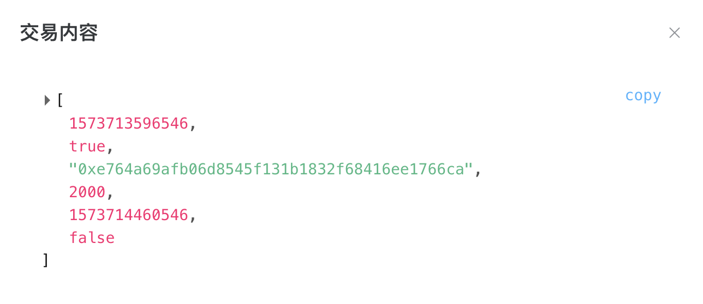

# 基于区块链的供应链金融平台 功能测试文档

## 合约部署

### WeBASE 搭建

Fisco-Bcos 平台详细的搭建过程在上一次实验过程和报告中已经详细呈现。WeBASE 管理和前端 Web 服务搭建过程可以参考 Fisco-Bcos 官方文档中的[一键部署内容](https://webasedoc.readthedocs.io/zh_CN/latest/docs/WeBASE/install.html)。部署完成之后，可以在宿主机浏览器中通过主机中虚拟机的内网 IP 和对应端口访问到 Web 服务。之后需要在节点管理中配置节点的前置列表，输入虚拟机 IP 地址和前置端口（默认为 5002），就可以正常链接到虚拟机上已经启动的节点了。

### 合约上传

在编写完合约之后，可以开始部署到平台上进行测试。在**合约管理**选项中选择**合约 IDE**，添加文件夹和合约代码文件之后，将源代码写入文件或者直接上传代码文件。代码文件名和合约名需要保持一致。如果代码通过编译，就可以部署了。

### 用户创建

为了进行部署与测试，首先需要创建一些用户作为合约的用户实体进行测试。这里我们创建以下用户：

- Bank：用于作为唯一的第三方银行用户，合约也需要部署在该用户之上；
- Alice、Bob、Cathy：合约测试用户甲乙丙 ABC。

### 正式部署

合约通过编译之后，在右上方选择部署，选择用户为创建完毕的 Bank，完成合约部署。

## 合约功能测试

为对合约中实现的各个功能进行测试，假定以下使用场景并进行相应交易发起：（为防止截图过多影响 markdown 排版，将截图装入表格，可以放大查看）

其中每个账户对应的地址哈希为：

- Bank: `0xbebd2f6bf9daa1757af12f7c216e3973ba1efe34`
- Alice: `0xdfd5110e4ae2a61566104def0ce92e76066793fc`
- Bob: `0xe764a69afb06d8545f131b1832f68416ee1766ca`
- Cathy: `0x214f7a85606e0698a7e59847596a566a6414ed48`

#### 用户初始化

测试 Bank 对 Alice 的资产初始化和信用评估。

|          init 函数调用          |          交易执行结果           |                         用户资产更新                         |                         用户信用更新                         |
| :-----------------------------: | :-----------------------------: | :----------------------------------------------------------: | :----------------------------------------------------------: |
|  |  |  |  |

为方便后续转账和贷款功能检测，将其他用户 Bob、Cathy 也进行初始化，每个用户具有 10000 资金。

#### 用户转账

测试用户对用户的转账功能，从 Alice 发起一笔金额 3000 的转账给 Bob。

|          tranferMoney 函数调用          |             交易执行结果 1              |             交易执行结果 2              |
| :-------------------------------------: | :-------------------------------------: | :-------------------------------------: |
|  |  |  |

然后继续通过 balances 的 mapping 查询两者的资产余额（后续由于需要查询的步骤过多，查询的功能和操作也非常简单，不再罗列截图），查得 Alice 资产余 7000，Bob 余 13000，功能表现正常。

#### 用户贷款

测试借出方同意贷款给贷款方，发起贷款功能，从 Cathy 发起一笔金额 2000 的贷款给 Bob，Cathy 是借出方，Bob 是贷款方，贷款期限为 10 天。

|          loan 函数调用          |         交易执行结果 1          |         交易执行结果 2          |           loans[Bob]            |            loans[Cathy]             |
| :-----------------------------: | :-----------------------------: | :-----------------------------: | :-----------------------------: | :---------------------------------: |
|  |  |  |  |  |

贷款交易发起的参数可以分别指定贷款方地址、贷款金额、贷款期限，借出方即为发起交易的用户主体。发起交易结果如上，完成之后通过 loans 的 mapping 分别查询 Bob 和 Cathy 账户下登记的贷款信息，字段分别为：交易 ID、主体是否为借出方、交易另一方地址、贷款金额、贷款截止时间戳、贷款是否完成。查询得双方管理的交易信息除了双方身份相关的字段不同之外，ID、金额、时间等都相同。且交易发起时间戳即为 ID，同时交易截止时间戳与其相差 864000，为十天的秒数。对贷款的管理表现正常。

交易完成之后，查询双方余额，Bob 账户中有 15000，Cathy 账户中有 8000，对账户资金的管理表现正常。

#### 贷款偿还

测试某笔贷款贷款方偿还贷款金的功能，由 Bob 主动发起对 Cathy 提供贷款金的偿还，测试部分偿还，所以先偿还贷款 2000 中的 1000，然后再偿还剩下的 1000。

|       payLoan 函数调用        |       首次交易执行结果        |        首次偿还贷款信息         |          第二次执行           |          最后贷款信息           |
| :---------------------------: | :---------------------------: | :-----------------------------: | :---------------------------: | :-----------------------------: |
|  |  |  |  |  |

两次偿还后 Bob 的现有资金金额都进行了更新（减少 1000），完全完成偿还后，该贷款被关闭，同时 Bob 的信用情况发生更新，因为及时偿还了，所以 Bob 的信用将增加。同时在 Cathy 端查看该贷款信息，也发生了同步更新。贷款偿还的管理表现正常。

交易完成之后，查询双方余额，Bob 账户中有 13000，Cathy 账户中有 10000，对账户资金的管理表现正常。

#### 贷款转移

测试某笔贷款借出方将该笔贷款的借出所有权转移给另一方并获得资金的功能，新建一笔 Alice 给 Bob 的贷款 1999 元，然后用其作为测试，从 Alice 发起一笔贷款转让，转让其中的 999 元给 Cathy。

| Alice 初始 loan 信息（此处贷款订单在 Alice 列表中索引为 1） |     transferLoan 函数调用     |        交易执行结果1        |        交易执行结果2        |
| :---------------------------------------------------------: | :---------------------------: | :-------------------------: | :-------------------------: |
|                                    |    |  |  |
|                       Alice loan 更新                       |        Cathy loan 更新        |      Bob 原 loan 更新       |      Bob 新 loan 更新       |
|                                |  |  |  |

转移之后 Alice 给 Bob 的原贷款金额更新减少，Cathy 新纪录了一笔给 Bob 的贷款，Bob 原贷款更新，并新增一笔来自 Cathy 的贷款。同时 Alice 的现有资产金额 balance 对应减少，Cathy 的对应增加。应用对贷款转移、资金管理的表现正常。

#### 请求融资

测试用户根据自身持有的应收账款向银行申请融资的功能，利用之前测试中持有了 Bob 的应收账款的 Cathy，向银行发起融资请求，请求融资 998 元，融资期 365 天。

|            financing 函数调用             |              交易执行结果               |
| :---------------------------------------: | :-------------------------------------: |
|  |  |

交易完毕之后，Cathy 持有的资金情况 balance 更新，即 Cathy 已经获得了银行的融资资金。应用对融资的处理表现正常。

> 功能中还包括一些合法性可行性判断的细节，比如借出方必须有足够资金、贷款方信用评估必须符合要求等，都在功能函数中加以判断，此处不详细罗列运行结果，在源代码的函数中可以看到相关条件语句实现。
>
>  
>
> 至此项目的基本功能都测试完毕，合约可以正常运行与表现。
>
> 其中许多金融制度的设计可能存在一些漏洞，但是已经可以实现简单的要求。如果后续过程中发现有不合理的地方，或是制度有应该改进完善之处，将在后续的实现中继续迭代。